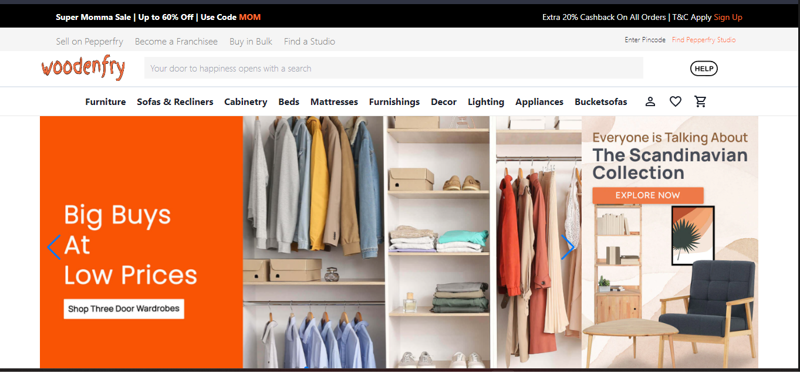
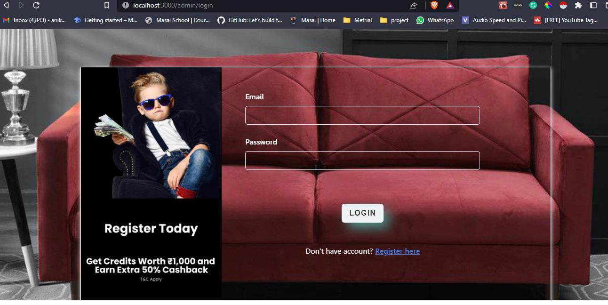
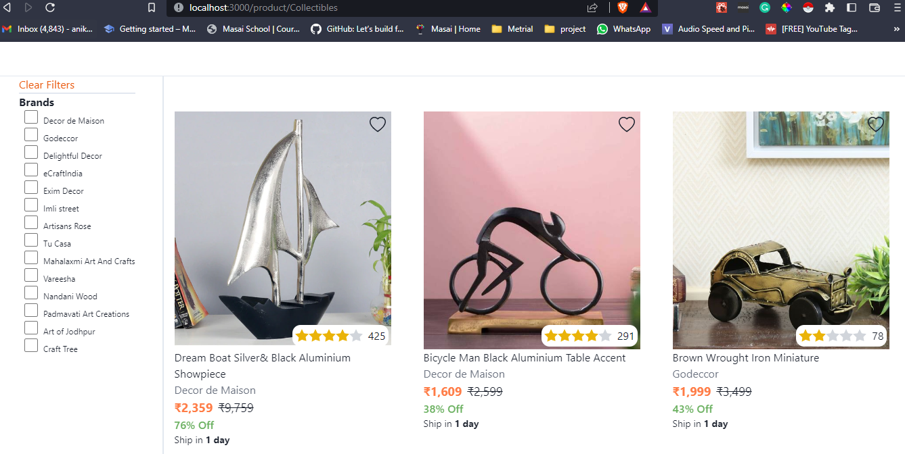
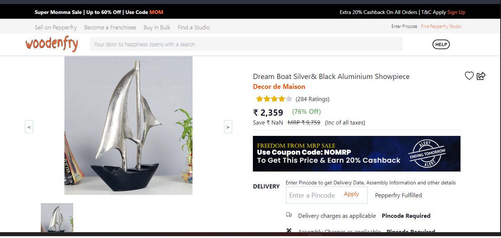
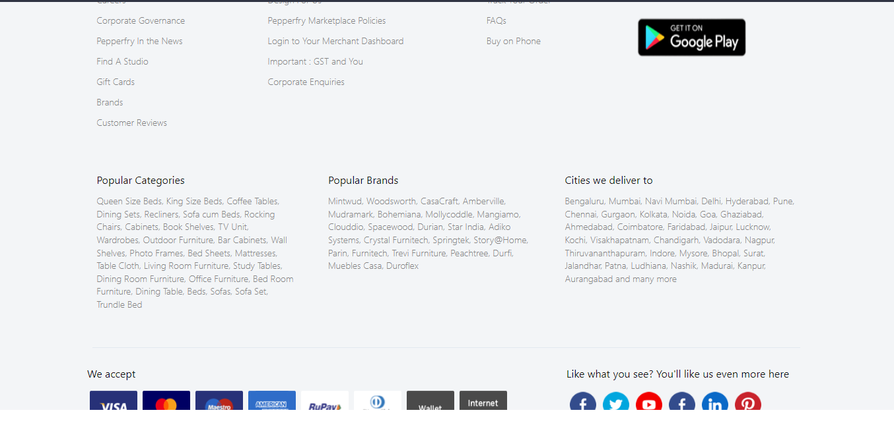

## pepperfry clone- woodennfry App
---

About
Pepperfry is an Indian online marketplace for furniture and home décor. The company was formed by Ex-eBay executives Ambareesh Murty and Ashish Shah started Pepperfry in Mumbai in 2012. The company is headquartered in Mumbai, Maharashtra and operates as a subsidiary of Trendsutra Platform Services Private Limited.

### Tech-Stack
___

* Reactjs
* Chakra UI
* Tailwind css
* javascript
* react-router
* redux
* Nodejs
* Miui
* Express

### Features
___
* User Authentication
* User Details Management 
* Show Details.
* Sorting, Filtering, and 
* Admin Panel
* Backend Api
* Animations
* Slider

### Fuctionality worked on-

| Team members | Functionality |
| ------ | ------ |
| Aniket Parmar | Product Page & Single Product Page |
| Daljeet Singh | Backend|
| Biswadip Roy | HomePage & Login |
| Vicky Das| Cart&Checkout&Wishlist |
| Vikram kumar | Admin Panel |

### Screenshots
___

*Home Page

*Login Page

*Product Page

*Single Product Page

*footer part

